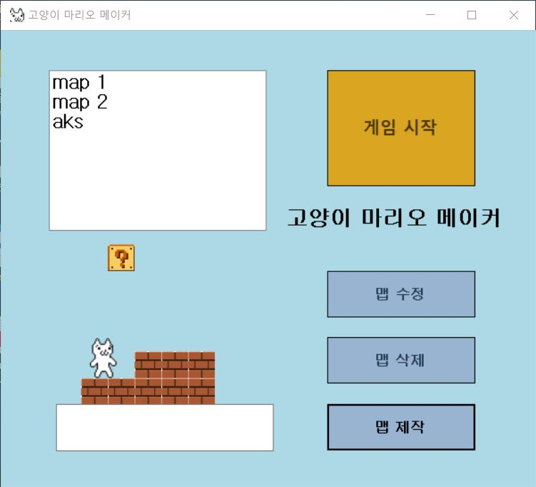
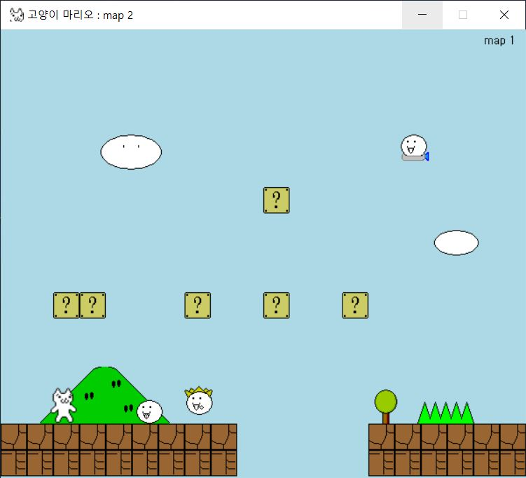
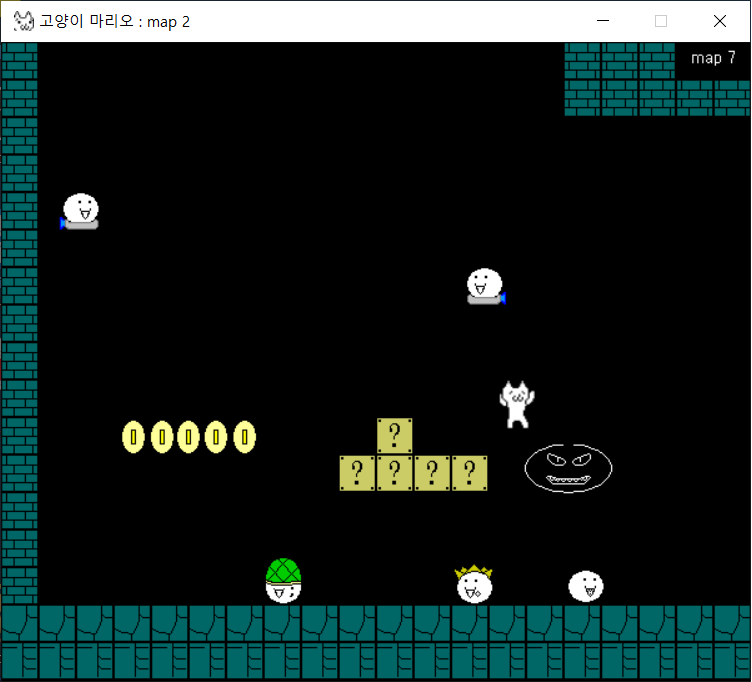
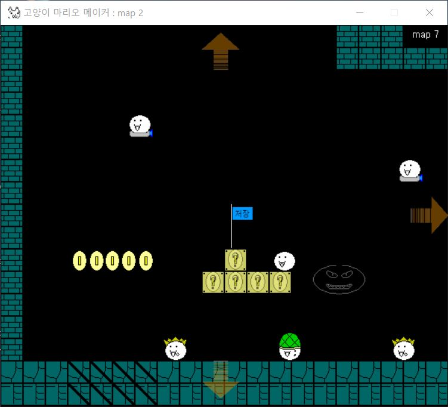
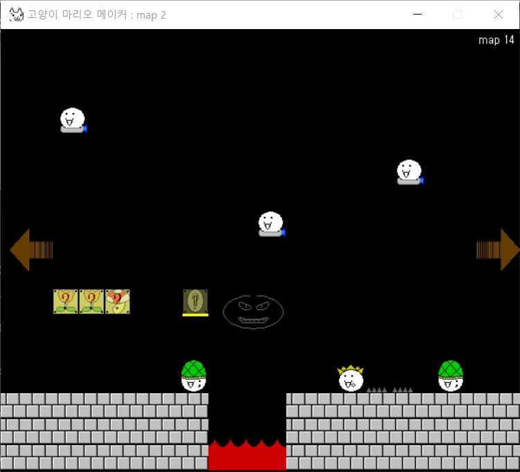
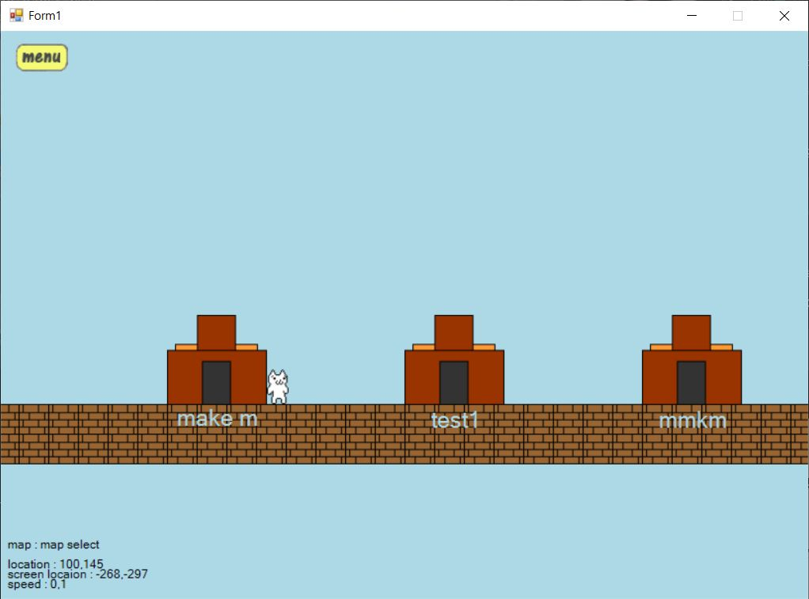

# 고양이 마리오 메이커

유저가 직접 맵을 만드는 제작자가 되거나, 플레이어가 되어 제작된 맵을 플레이할 수 있는 게임. 
플레이어는 캐릭터를 움직여 맵의 끝에 다다르는 것이 게임의 목표이고, 제작자는 플레이어가 목표를 달성하지 못하게 각종 함정으로 방해하는 것이 목표이다.

- 캐릭터는 플레이어가 키보드를 통해 움직이며 좌우로 움직이거나 점프할 수 있다.

- 하나의 맵은 여러개의 세부맵으로 분할되어 있다.
- 각 세부맵은 블럭, 장식물, 몹으로 이루어져 있다. 
- 블럭은 캐릭터와 충돌하는 바닥과 벽이 되는 요소이다.
- 장식물은 장식하는 요소로 대부분 캐릭터와 충돌하지 않는다. 단, 특정 장식물이나 함정이 적용된 장식물은 캐릭터와 충돌시 상호작용한다.
- 몹은 일정한 규칙으로 움직이며 캐릭터가 몹과 부딪히면 임무실패가 된다. 하지만 특정 몹을 제외하면 캐릭터가 밟아 제거할 수 있다.
- 세부맵의 상하좌우 각각으로 세부맵을 연결하면, 캐릭터가 해당 방향으로 화면을 벗어나려 할때 연결된 세부맵으로 이동시킨다.
- 아래쪽으로 연결된 세부맵이 없는데 캐릭터가 아래방향으로 벗어나려 할 경우, 임무실패로 간주한다.

- 제작자는 마우스를 이용해 맵을 직접 만들거나 수정할 수 있고, 이는 map_list 폴더에 파일로 저장된다.
- 제작자는 블럭, 장식물, 움직이는 몹을 배치하거나, 배경음과 배경화면의 테마를 지정하여 세부맵을 설계한다. 이때 블럭이나 장식물에 함정을 적용할 수 있다.
- 제작자는 세부맵에 다른 세부맵들을 연결해가며 맵을 제작한다.
- 이후 저장된 맵을 불러와 직접 플레이할 수 있다.

작동 화면
===================

첫 실행화면. 
- 유저는 왼쪽 위의 맵 리스트에서 맵을 선택하여 게임 시작 버튼을 누르거나 맵을 더블클릭하여 게임을 플레이할 수 있다.
- 맵 리스트에서 맵을 선택하고 맵 수정이나 삭제버튼으로 맵을 조작할 수 있다.
- 왼쪽 밑의 빈칸에 맵 이름을 입력하고 맵 제작버튼으로 맵을 새로 만들 수 있다.

실제 플레이 화면

실제 플레이 화면 2 - 숨겨진 함정에 걸려 실패한 모습

맵 제작 화면 - 위의 플레이 화면을 제작도구로 본 모습
- 맵 가장자리의 화살표들은 이 방향으로 이어진 맵들이 있다는 것을 의미한다.
- 왼쪽 아래의 검은 선으로 표시된 블럭들은 함정이 적용되어 다른 블럭과 똑같이 보이지만 충돌하지 않는다.
- '저장'이라고 적힌 깃발은 세이브 포인트로, 플레이어가 깃발에 닿으면 이후 실패할 시에 이곳에서부터 다시 시작한다.

맵 제작 화면 2 - 숨겨진 블럭, 구름 함정, 가시 함정을 설치한 모습

개발 동기 등
==================

클래스라는 것을 모르던 시절, C#을 처음 배우고 그래픽 처리를 조금 해보다가 그대로 만들어버린 프로젝트
- 더블 버퍼링을 사용한 그래픽 처리 예제 코드를 가지고 어디까지 만들 수 있을까? 에서 이 프로젝트를 시작되었다.
- 프로젝트 폴더 이름이 sample인 이유
- 개발 기간은 C#을 처음 배우는 것부터 시작하여 약 3주
- 클래스라는 것도 모르던 때에 만든 프로젝트, 코드 정리가 하나도 되어있지 않아 코드 읽기가 힘들어 수정이 불가능하다...
- 첫 프로젝트로 결과에 나름 만족하면서도 문제점들을 해결하고 지속적으로 개발할수 있도록 다시 만들고 싶은 마음이 강했다.
- 이후 이를 주제로 프로젝트로 몇번 시작했지만 새로운 문제들이 튀어나와 번번이 실패했다.

- 하지만 이런 실패 경험들이 다른 프로젝트들의 진행에 많은 도움이 되었다.
- 첫 프로젝트라 그런지 이 프로젝트에 애정을 갖고 있어 나중에 동적인 이벤트를 포함하여 많은 기능들을 추가한 프로젝트로 다시 도전할 생각이다.

게임의 원판은 한국에서는 '고양이 마리오'라고 알려져 있는 게임이며 리소스 역시 이 게임에서 따왔다.

문제와 해결법, 구현과정
====================

동작과 계산 관련
-----------------
타이머를 이용해 일정한 시간마다 화면에 그래픽 요소를 그린다. 이때 GDIBuffer 객체를 이용해 더블버퍼링 기법을 사용한다.
- 화면에 표시되어야 할 모든 요소는 GDIBuffer의 bitmap 객체에 정해진 그림을 그린다.
- 모든 요소를 GDIBuffer의 bitmap객체에 그린 이후에 GDIBuffer의 bitmap객체를 활용해 화면을 한번에 그린다.
- 이 기법으로 c++의 콘솔환경에서 부드러운 움직임을 보이는 테트리스를 만들어보는 등, 이후 진행한 여러 프로젝트에서 활용하였다.

다른 타이머를 이용해 일정 시간마다 모든 요소들의 위치와 상태를 계산한다.
- 먼저 키 입력의 상황을 체크해 캐릭터가 다음 프레임에 이동할 위치를 계산한다.
- 캐릭터가 이동할 예상 위치의 좌표값에 충돌가능한 장애물이 존재하는지의 여부를 확인한다.
- 만약 장애물이 존재한다면 충돌할 요소에 따라 정해진 상호작용을 수행한다.

처음에는 그래픽 처리와 요소들의 좌표 계산을 한 타이머로 동시에 수행했지만, 개발이 진행되면서 계산량이 늘어나고 화면에 표시할 요소들이 많아지자 밀리는 현상이 발생했다.
- 이 현상을 해결하기 위해 좌표 계산 프로세스는 화면에 출력하는 프로세스와 분리시켰다.

캐릭터의 이동을 자연스럽게 하기 위해 중력, 가속도, 마찰력 등을 대략적으로 적용하였다.
- 그런데 몹들에게는 중력조차 적용하지 않았다... 그래서 몹들은 일정한 속도로 움직이고 떨어진다.

데이터 저장 및 로딩 관련
--------------------
맵의 구성 요소들은 저장 규칙을 직접 설계하여 저장하였다.
- 첫번째 줄은 헤더로, 세부맵의 갯수와 처음에 시작하는 세부맵의 번호, 좌표를 저장한다.
- 두번째 줄부터는 한줄에 하나씩 세부맵에 대한 모든 정보들을 저장한다.
- 블럭이 배치될 좌표는 그리드 형식으로 정해져 있어 정해진 모든 칸의 블럭 종류, 블럭에 적용된 트릭과 함정에 대한 정보를 4자리의 숫자로 저장한다. 블럭이 없는 빈 영역도 비어있다고 저장한다.
- 모든 블럭이 저장된 후에는 해당 세부맵의 상하좌우로 이어지는 세부맵에 대한 정보를 저장한다.
- 마지막에는 장식물과 몹의 종류와 좌표를 저장한다.
- 해당 파일은 map_list 폴더에 txt파일로 저장하게 된다.

- 프로그램 첫 실행시에 map_list 폴더에서의 파일의 존재 여부로 맵의 존재를 확인한다.
- 사용자가 맵을 선택하면 해당 맵에 대응하는 파일을 읽어들인다.

프로그램을 실행시 필요한 리소스들을 모두 한꺼번에 로딩하고 필요한 인스턴스들을 생성하다 보니 지연시간이 꽤나 길었다.
- 특히 효과음을 미리 로딩하는 부분이 시간을 많이 잡아먹었는데, 여러 스레드로 로딩하여 해결하였다.
- 하지만 게임에 사용된 모든 타이머는 UI스레드에서 작동하기에 컴퓨터의 속도에 따라 캐릭터의 속도가 다르다...
- 이후 프로젝트부터는 멀티스레드를 적극 활용하여 비슷한 문제가 발생하지 않도록 구현하기 시작했다.
